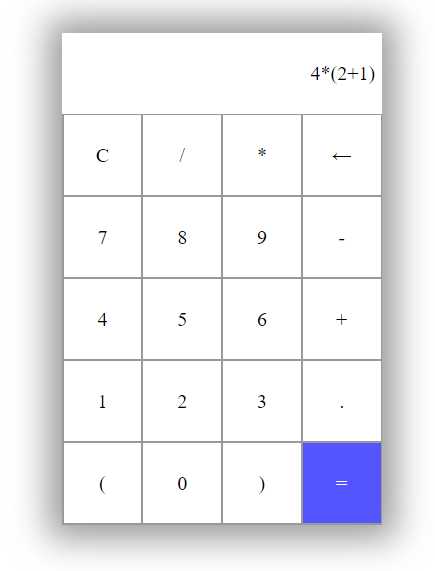
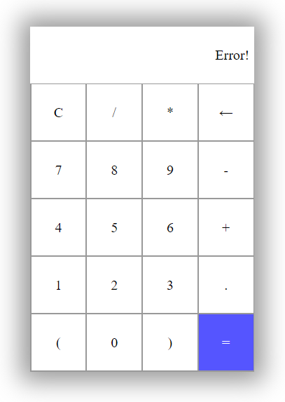

# Calculator
A Simple Calculator App using vanilla JS

## Table of contents
* [Technologies](#technologies)
* [Functionalities](#functionalities)
* [Screens](#screens)
* [Live](#live-star2)

## Technologies
Project was created with:
* HTML5
* CSS3
* JavaScript

## Functionalities
In project You are able to:
* evaluate mathematical operations like adding, subtracting, multiplying, dividing.
* find an Error if not a valid operation is submitted e.g. operation +-*= will return Error

## Screens   

 
 

## Live :star2:
https://zasada94.github.io/calculator/

